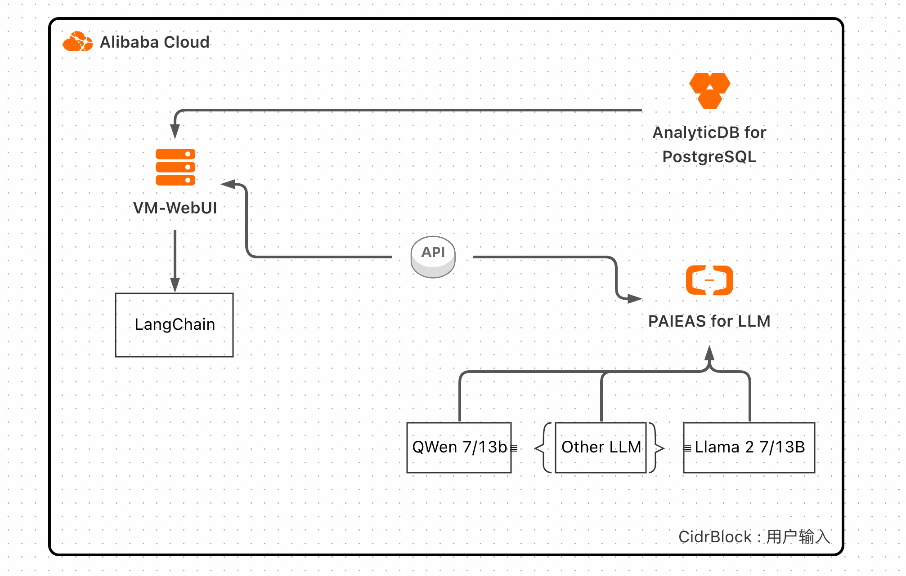
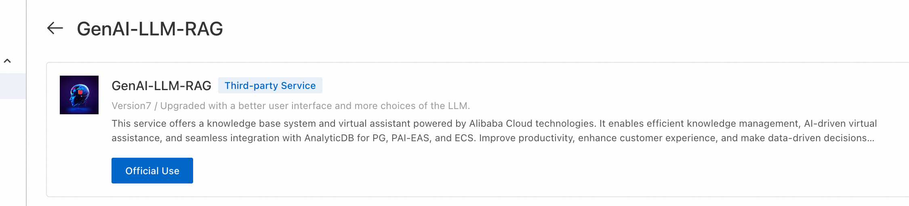
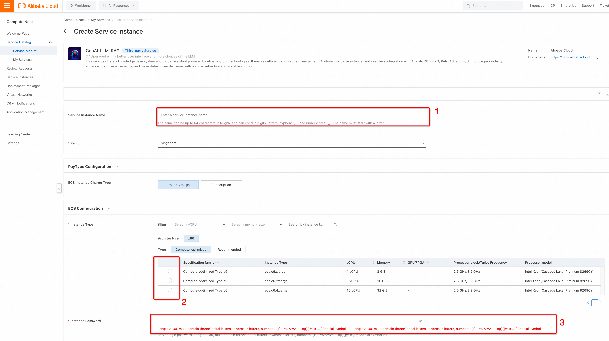
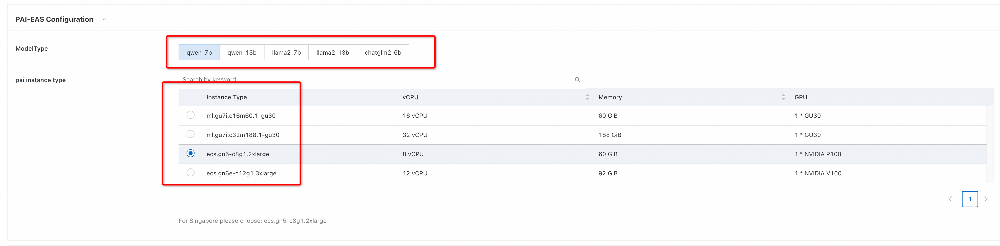
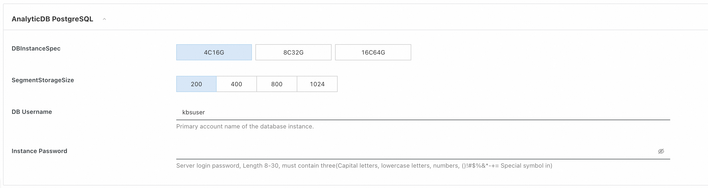
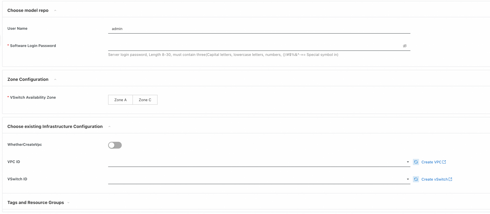
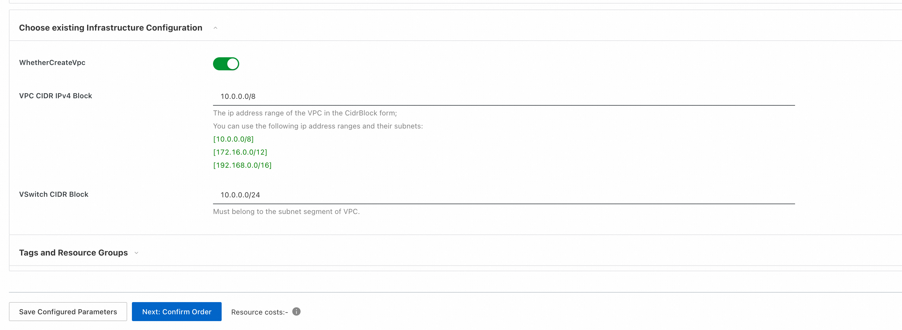
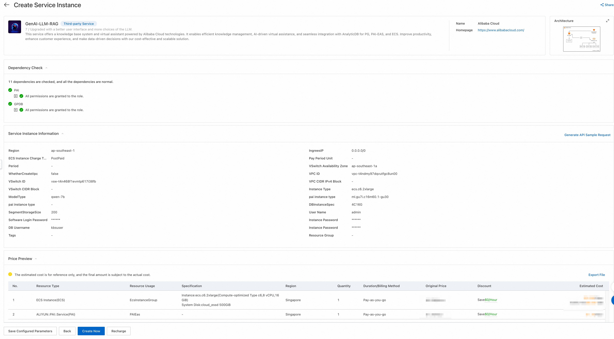
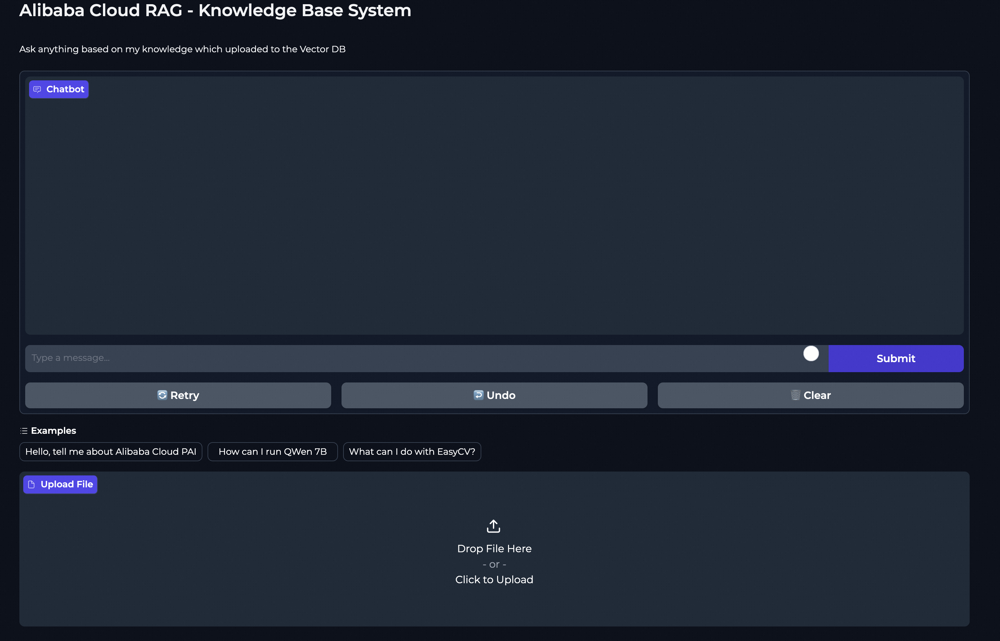

# Quick Building a RAG Service on Compute Nest with LLM on PAI-EAS and AnalyticDB for PostgreSQL - GenAI-LLM-RAG

## Introduction
This guide will walk you through the process of creating a Retrieval-Augmented Generation (RAG) service using Compute Nest with Large Language Models (LLM) on Alibaba Cloud's Platform for AI – Elastic Algorithm Service (PAI-EAS), AnalyticDB for PostgreSQL as the vector store, Gradio for the web UI, and Langchain for orchestration.

## Prerequisites
- An active Alibaba Cloud account
- Familiarity with cloud services and AI models

## Step 1: Alibaba Cloud Account Setup
Ensure you have an Alibaba Cloud account. Sign up [here](https://www.alibabacloud.com/) if you still need to do so.

## Step 2: Access Compute Nest
Find the service [GenAI-LLM-RAG](https://computenest.console.aliyun.com/user/ap-southeast-1/serviceInstanceCreate?ServiceId=service-d3a14420ecbb4759bfc0) in Alibaba Cloud->Console->Compute Nest with your Alibaba Cloud credentials. And press the "Offical Use."

## Step 3: Set Up an Instance and Its Parameters
Set up the necessary parameters of the instance:

1. Enter the service instance name
2. Choose ECS (Elastic Computing Services) parameters. Recommended to choose ecs.c6.2xlarge. In this case, the uploaded document will be faster
3. Insert instance password

## Step 4: Create a PAI-EAS Service for LLM
Deploy a pre-trained LLM on PAI-EAS:
1. Choose the suitable LLM from the menu.
2. Set the instance type
3. Deploy and note the API endpoint.

## Step 5: Setup AnalyticDB for PostgreSQL
1. Choose the AnalyticDB for PostgreSQL instance specification.
2. Segment Storage Size: The size of the documents could be decided depending on your knowledge.
3. The default DB username is "kbsuser". Usually, the database name will be the same as the user name. Feel free to put another username. 
4. You need to create a strong password, for instance. Note: not use in a password symbol "@"

## Step 6: WebUI Credential and Network Configuration
1. The default username is "admin". You could choose another username. 
2. You need to create a strong password, for instance.

3. As VPC can be chosen from existing VPC. To create a new VPC, you can activate the slider and put related information.
4. After, press "Next: Confirm Order."

## Step 7: Integrate Gradio for Web UI
Create a web UI with Gradio:
1. Set up Gradio.
2. Connect it to the backend services (PAI-EAS, vector store).

## Step 8: Deploy Your RAG Service
After checking all related information and accepting the "Terms of Service" by pressing "Create Now," the service can be deployed. Need to wait for a while to finish all the steps.

## Using the RAG Service

### General Question Answering
Users can ask questions through the Gradio web UI, and the LLM will process and provide answers.

### Uploading Documents for Retrieval Augmentation
Users can upload documents converted into vector store and save them in AnalyticDB for PostgreSQL.

### Modifying the Service via ECS
Authorized users can access ECS to make changes or updates to the service.

## Additional Resources
For more detailed information, consult the following:
- [Compute Nest Documentation](https://www.alibabacloud.com/blog/compute-nest-enabling-cutting-edge-generative-ai-integration-and-knowledge-base-systems-in-collaboration-with-alibaba-cloud_600421)
- [Alibaba Cloud PAI-EAS Documentation](https://www.alibabacloud.com/help/en/pai/user-guide/overview-2)
- [AnalyticDB for PostgreSQL Documentation](https://www.alibabacloud.com/help/product/28108.htm)
- [Gradio Documentation](https://www.gradio.app/docs/interface)
- [LangChain Documentation](https://python.langchain.com/docs/get_started/introduction)

Additional tutorials:
- [Empowering Generative AI with Alibaba Cloud PAI's Advanced LLM and LangChain Features](https://www.alibabacloud.com/blog/empowering-generative-ai-with-alibaba-cloud-pais-advanced-llm-and-langchain-features_600577)
- [Solution 1B: How to Use ECS + PAI + AnalyticDB for PostgreSQL to Build a Llama2 Solution](https://www.alibabacloud.com/blog/solution-1b-how-to-use-ecs-%2B-pai-%2B-analyticdb-for-postgresql-to-build-a-llama2-solution_600287)
- [Tutorial: Building an Exciting Journey for Your GenAI Application with Llama 2, AnalyticDB, PAI-EAS](https://www.alibabacloud.com/blog/tutorial-building-an-exciting-journey-for-your-genai-application-with-llama-2-analyticdb-pai-eas_600283)
- [https://www.alibabacloud.com/blog/mastering-generative-ai---run-llama2-models-on-alibaba-clouds-pai-with-ease_600229](https://www.alibabacloud.com/blog/mastering-generative-ai---run-llama2-models-on-alibaba-clouds-pai-with-ease_600229)
- [Next-Level Conversations: LLM + VectorDB with Alibaba Cloud Is Customizable and Cost-Efficient](https://www.alibabacloud.com/blog/next-level-conversations-llm-%2B-vectordb-with-alibaba-cloud-is-customizable-and-cost-efficient_599985)

By following this guide, you should be able to set up a functional RAG service on Compute Nest, leveraging the powerful features of PAI-EAS, AnalyticDB, Gradio, and Langchain.
